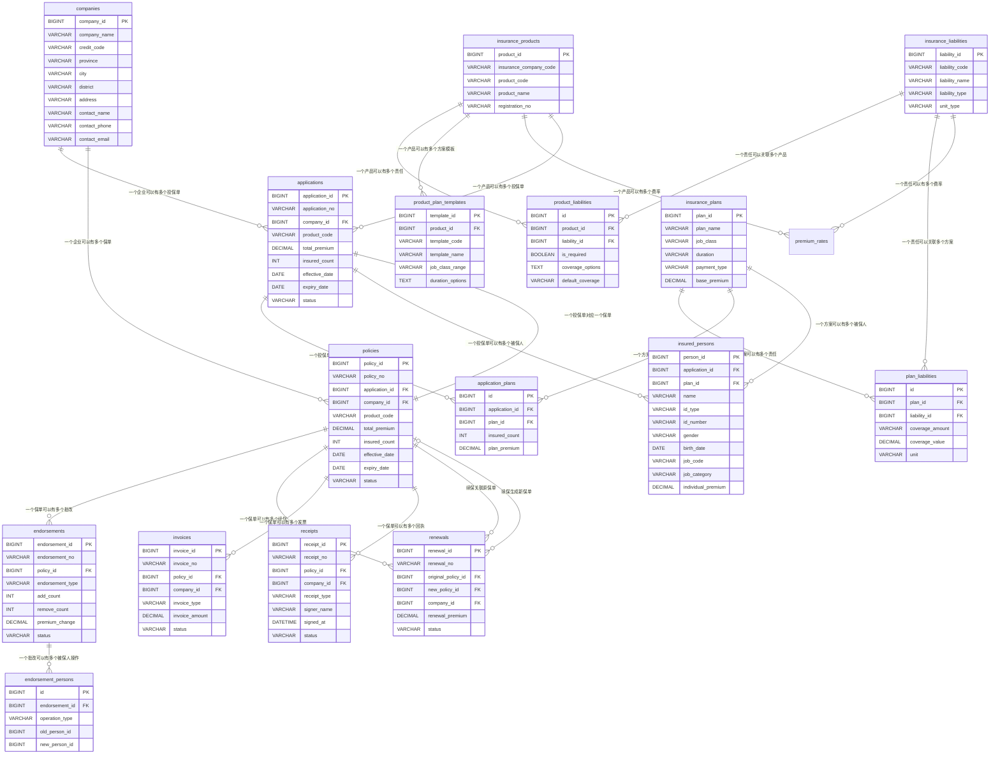
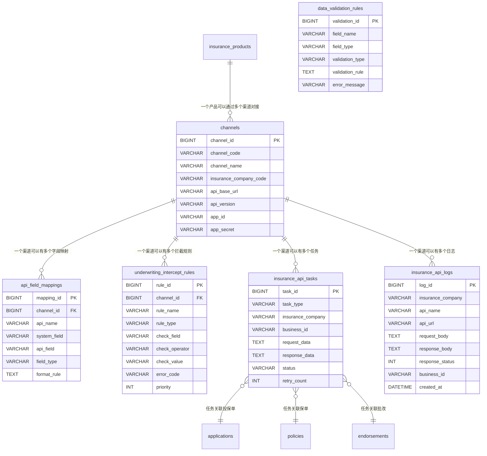
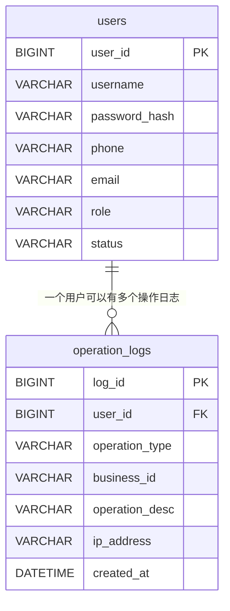

# 数据库结构图

## 一、核心业务表关系图



## 二、接口对接相关表关系图



## 三、系统管理表关系图



## 四、完整数据库表清单

### 4.1 核心业务表（14张）

1. **companies** - 投保企业表
2. **insurance_products** - 保司产品表
3. **insurance_liabilities** - 保险责任表
4. **product_liabilities** - 产品责任关联表
5. **product_plan_templates** - 产品方案模板表
6. **insurance_plans** - 投保方案表
7. **plan_liabilities** - 方案责任关联表
8. **applications** - 投保单表
9. **application_plans** - 投保单方案关联表
10. **insured_persons** - 被保人表
11. **policies** - 保单表
12. **endorsements** - 批改申请表
13. **endorsement_persons** - 批改被保人明细表
14. **renewals** - 续保申请表
15. **invoices** - 发票申请表
16. **receipts** - 回执表

### 4.2 接口对接表（7张）

1. **channels** - 渠道配置表
2. **api_field_mappings** - 接口字段映射表
3. **underwriting_intercept_rules** - 承保拦截规则表
4. **data_validation_rules** - 数据校验规则表
5. **insurance_api_tasks** - 保司接口任务表
6. **insurance_api_logs** - 保司接口调用日志表
7. **insurance_api_configs** - 保司接口配置表

### 4.3 配置管理表（3张）

1. **premium_rates** - 费率配置表
2. **insurance_api_configs** - 保司接口配置表（与接口对接表重复）

### 4.4 系统管理表（2张）

1. **users** - 用户表
2. **operation_logs** - 操作日志表

**总计：约28张表**

## 五、核心业务流程表关系

### 5.1 投保流程

```
companies (企业)
    ↓
applications (投保单)
    ↓
application_plans (投保单方案关联)
    ↓
insurance_plans (方案)
    ↓
plan_liabilities (方案责任关联)
    ↓
insurance_liabilities (责任)
    ↓
insured_persons (被保人)
```

### 5.2 产品配置流程

```
insurance_products (产品)
    ↓
product_liabilities (产品责任关联)
    ↓
insurance_liabilities (责任)
    ↓
product_plan_templates (方案模板)
    ↓
premium_rates (费率配置)
```

### 5.3 承保流程

```
applications (投保单)
    ↓
underwriting_intercept_rules (拦截规则检查)
    ↓
api_field_mappings (字段映射)
    ↓
channels (渠道配置)
    ↓
insurance_api_tasks (接口任务)
    ↓
insurance_api_logs (接口日志)
    ↓
policies (保单)
```

## 六、表关系说明

### 6.1 一对多关系

- 一个企业 → 多个投保单
- 一个企业 → 多个保单
- 一个产品 → 多个责任（通过 product_liabilities）
- 一个产品 → 多个方案模板
- 一个产品 → 多个费率配置
- 一个投保单 → 多个方案（通过 application_plans）
- 一个投保单 → 多个被保人
- 一个方案 → 多个责任（通过 plan_liabilities）
- 一个方案 → 多个被保人
- 一个保单 → 多个批改
- 一个保单 → 多个续保
- 一个保单 → 多个发票
- 一个保单 → 多个回执
- 一个渠道 → 多个字段映射
- 一个渠道 → 多个拦截规则

### 6.2 多对多关系

- 产品 ↔ 责任（通过 product_liabilities）
- 方案 ↔ 责任（通过 plan_liabilities）
- 投保单 ↔ 方案（通过 application_plans）

### 6.3 一对一关系

- 投保单 ↔ 保单（一个投保单对应一个保单）

## 七、关键索引建议

### 7.1 唯一索引

- `companies.credit_code` - 统一社会信用代码
- `applications.application_no` - 投保单号
- `policies.policy_no` - 保单号
- `insurance_liabilities.liability_code` - 责任代码
- `channels.channel_code` - 渠道代码

### 7.2 外键索引

- `applications.company_id`
- `applications.product_code`
- `policies.company_id`
- `policies.application_id`
- `product_liabilities.product_id`
- `product_liabilities.liability_id`
- `plan_liabilities.plan_id`
- `plan_liabilities.liability_id`
- `insured_persons.application_id`
- `insured_persons.plan_id`

### 7.3 查询索引

- `applications.status`
- `policies.status`
- `insurance_api_logs.business_id`
- `insurance_api_logs.created_at`
- `underwriting_intercept_rules.status`
- `underwriting_intercept_rules.priority`
- `premium_rates.job_class`

